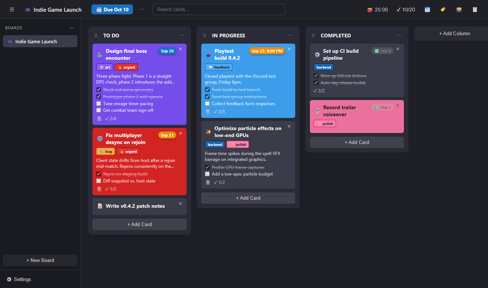
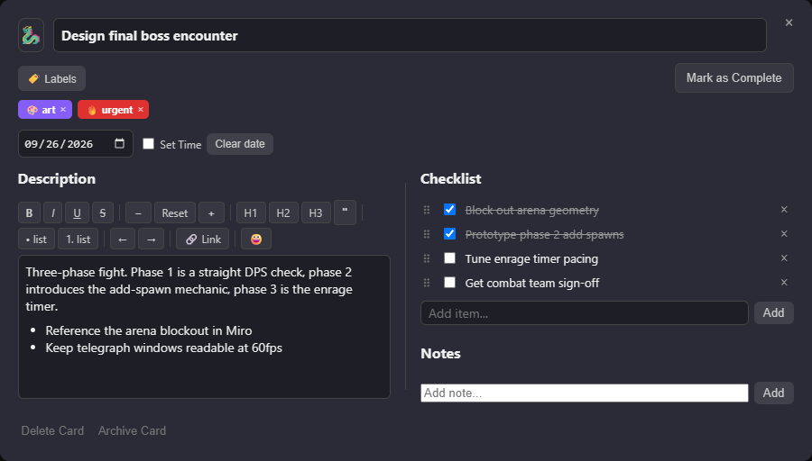
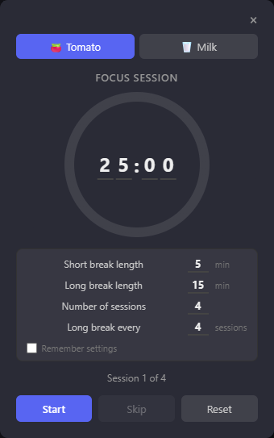
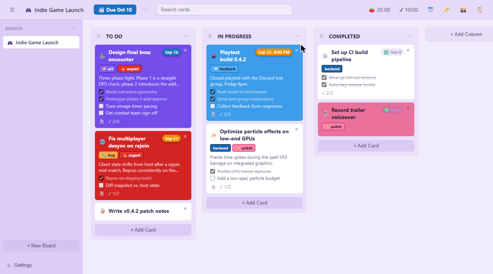

# kkanban

A desktop kanban board built with [Tauri](https://tauri.app/) — vanilla HTML/CSS/JS on the frontend, a small Rust backend for local persistence. Built as a personal project to learn Tauri and to have a kanban tool that actually works the way I want it to.



## Features

- **Boards & columns** — multiple boards, drag-and-drop reordering of both columns and cards
- **Sidebar categories** — group boards into collapsible categories, with drag-and-drop between them
- **Cards** — titles, emoji icons, custom colors (plus a saved custom color palette), due dates (with optional time), completion state
- **Copy, move & duplicate cards** — Ctrl+C/Ctrl+V or right-click, including moving/copying a card to another board (its labels are matched or recreated there)
- **Recurring cards** — daily, weekly, or monthly; completing one creates the next with its due date moved forward and its checklist reset
- **Undo delete** — deleted cards and columns can be restored from an Undo toast or Ctrl+Z
- **Labels** — color-coded, with a quick-add template library of common categories
- **Rich-text descriptions** — bold/italic/underline/strikethrough, headings, lists, links, font size, emoji insertion, markdown paste support
- **Checklists** — per-card checklists with drag-to-reorder items, plus a live checklist preview right on the board card (check items off without opening the card)
- **Calendar view** — see every card with a due date laid out by month
- **Due-time alarms** — Windows notifications when a timed card or board is due, with a button that opens kkanban straight to that card
- **Whiteboard** — a per-board sketch canvas with multiple pages: shapes, freehand pen, attachable connector arrows, text, pasted/dropped images, copy/paste, and undo/redo
- **Board backgrounds** — custom image backgrounds with adjustable blur
- **Themes** — Dark, Light, Lavender, and a seasonal Christmas theme, plus optional background patterns
- **Pomodoro timer** — full work/break session planner (configurable lengths, session count, long-break cadence), two visual styles (tomato/milk), a floating on-board overlay with its own quick controls, and a header hover popover for pause/skip/reset without opening the panel
- **Search & filter** — search cards by title, description, and checklist content, and filter by label or hide completed cards
- **Backups** — one-click export/import of everything (including images), plus automatic daily backups (last 14 kept)

## Screenshots

| Card detail | Pomodoro timer | Lavender theme |
| --- | --- | --- |
|  |  |  |

## Tech stack

- **Frontend:** vanilla JavaScript (no framework, no bundler), HTML, CSS
- **Backend:** Rust via [Tauri v2](https://tauri.app/), used for local file-based persistence (board data, images, automatic backups), Windows notifications, and `kkanban://` deep links

## Running locally

```
npm install
npm run tauri dev
```

To build a distributable app:

```
npm run tauri build
```

**Note on audio:** the Pomodoro timer's sound effects (`src/assets/sounds/`) are sourced from a paid asset pack and are intentionally excluded from this repository (see [Credits](#credits) below) — a fresh clone will run fine, just silently, until you drop your own `.wav`/`.mp3` files in with matching filenames (see the `playPomoSound` calls in `src/main.js` for the exact names expected).

**Note on the app icon:** `src-tauri/icons/` is also excluded — the artwork is a purchased asset, and unlike the audio, `tauri.conf.json` actually needs these files to exist for `tauri dev`/`tauri build` to succeed at all, so **a fresh clone will not build until you generate your own set**:

```
npx tauri icon path/to/your/icon.png
```

(Any square PNG works; 256×256 or larger is plenty for Windows. This regenerates every file `tauri.conf.json` points at.)

## Credits

- **Microsoft Fluent Emoji** (3D) — used for the Pomodoro tomato icon. [MIT License](https://github.com/microsoft/fluentui-emoji/blob/main/LICENSE), © Microsoft.
- **Twemoji** — used for flag icons (Windows' system emoji font has no real flag glyphs). [CC-BY 4.0](https://github.com/twitter/twemoji/blob/master/LICENSE-GRAPHICS), © Twitter, Inc.
- Pomodoro sound effects are from a licensed paid asset pack and are not included in this repository.
- The app icon is a licensed purchased asset and is not included in this repository.
- Built with [Claude](https://claude.com/claude-code) as a pair-programming partner for every feature.

## License

[MIT](LICENSE)
